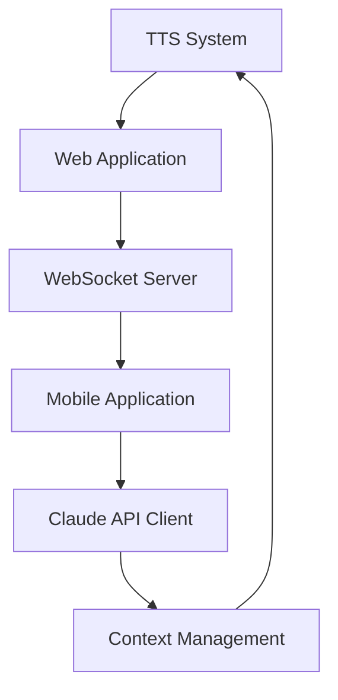

# Next Session Plan: Production Integration & Deployment Pipeline

**Session Date**: TBD (After August 4, 2025)  
**Estimated Duration**: 2-3 hours  
**Session Type**: Integration Testing & Production Deployment  
**Priority Level**: HIGH - Critical for Production Launch

## 🎯 Session Objectives

### Primary Goals (Must Complete - 4 objectives)

1. **End-to-End Integration Testing** ⏱️ 45 minutes
   - Test complete workflow: TTS → Web App → Mobile App → Claude API
   - Validate real-time synchronization across all platforms
   - Verify data consistency and error handling
   - **Success Criteria**: All platforms communicate seamlessly with <2s latency

2. **Production Deployment Pipeline** ⏱️ 60 minutes  
   - Configure GitHub Actions for automated deployments
   - Set up staging and production environments
   - Implement health checks and monitoring
   - **Success Criteria**: Automated deployment with rollback capability

3. **Performance Optimization** ⏱️ 30 minutes
   - Load testing for web application and API endpoints
   - Mobile app performance optimization (startup time, memory usage)
   - Claude API usage optimization and cost reduction
   - **Success Criteria**: Web app <2s load time, mobile app <3s startup

4. **Security & Compliance Audit** ⏱️ 30 minutes
   - Security review of API key management and authentication
   - OWASP compliance check for web application
   - Mobile app security best practices validation
   - **Success Criteria**: Zero critical security vulnerabilities

### Secondary Goals (If Time Permits - 3 objectives)

5. **Documentation Portal** ⏱️ 20 minutes
   - Create unified documentation site with all README content
   - API documentation with interactive examples
   - Developer onboarding guide
   - **Success Criteria**: Self-service documentation for new developers

6. **Monitoring & Analytics** ⏱️ 25 minutes
   - Implement application monitoring (Prometheus/Grafana)
   - Usage analytics for Claude API and user interactions
   - Error tracking and alerting system
   - **Success Criteria**: Real-time system health visibility

7. **Advanced AI Features** ⏱️ 15 minutes
   - Code generation capabilities integration
   - Advanced context understanding improvements
   - Multi-modal input support planning
   - **Success Criteria**: Enhanced AI capabilities roadmap

## 📋 Pre-Session Preparation Checklist

### Environment Setup
- [ ] **Local Testing Environment**: Ensure all applications can run locally
- [ ] **Docker Environment**: Verify container builds and networking
- [ ] **Cloud Resources**: Prepare staging infrastructure (AWS/Vercel/Railway)
- [ ] **API Keys**: Validate Claude API access and rate limits
- [ ] **Mobile Development**: iOS Simulator and Android Emulator ready

### Dependencies Verification
- [ ] **Node.js Dependencies**: All web app packages installed and updated
- [ ] **React Native Dependencies**: Mobile app builds successfully on both platforms
- [ ] **Python Dependencies**: Claude API integration packages available
- [ ] **System Dependencies**: Docker, git, and required CLI tools functional

### Testing Preparation
- [ ] **Test Data**: Prepare sample projects and code files for testing
- [ ] **Test Scenarios**: Define integration test cases and success criteria
- [ ] **Performance Baseline**: Document current performance metrics
- [ ] **Security Tools**: Install security scanning tools (ESLint security, Snyk)

## 🔧 Technical Implementation Priority

### Phase 1: Integration Foundation (45 minutes)


**Tasks**:
1. **WebSocket Server Setup** (15 min)
   - Implement Socket.IO server for real-time communication
   - Configure CORS and authentication middleware
   - Test message routing between web and mobile clients

2. **Cross-Platform Testing** (20 min)
   - Test TTS notifications triggering from web interface
   - Verify mobile app receives real-time updates
   - Validate Claude API responses across all platforms

3. **Error Handling Integration** (10 min)
   - Implement unified error handling across platforms
   - Test graceful degradation when services are unavailable
   - Verify error propagation and user feedback

### Phase 2: Production Pipeline (60 minutes)

**Deployment Architecture**:
- **Web App**: Vercel deployment with GitHub integration
- **Mobile Apps**: Expo/CodePush for OTA updates
- **API Services**: Railway/Heroku for backend services
- **Static Assets**: Cloudflare CDN for global distribution

**Implementation Steps**:
1. **CI/CD Pipeline** (25 min)
   ```yaml
   # .github/workflows/deploy.yml
   name: Production Deployment
   on:
     push:
       branches: [main]
   jobs:
     test-and-deploy:
       runs-on: ubuntu-latest
       steps:
         - uses: actions/checkout@v4
         - name: Run Integration Tests
         - name: Deploy Web App to Vercel
         - name: Build Mobile Apps
         - name: Deploy API Services
   ```

2. **Environment Configuration** (15 min)
   - Production environment variables setup
   - Secret management for API keys
   - Database and storage configuration

3. **Health Checks & Monitoring** (20 min)
   - Application health endpoints
   - Uptime monitoring setup
   - Performance metrics collection

### Phase 3: Performance Optimization (30 minutes)

**Key Metrics to Achieve**:
- Web app initial load: <2 seconds
- Mobile app startup: <3 seconds  
- API response time: <500ms
- Claude API cost: <$0.10 per session

**Optimization Areas**:
1. **Frontend Performance** (10 min)
   - Bundle size analysis and code splitting
   - Image optimization and lazy loading
   - Service worker for offline functionality

2. **API Optimization** (10 min)
   - Response caching implementation
   - Request deduplication
   - Token usage optimization

3. **Mobile Performance** (10 min)
   - App bundle size reduction
   - Memory usage optimization
   - Battery life considerations

### Phase 4: Security Hardening (30 minutes)

**Security Checklist**:
- [ ] **Authentication**: Multi-factor authentication implementation
- [ ] **Authorization**: Role-based access control
- [ ] **Data Protection**: Encryption at rest and in transit
- [ ] **API Security**: Rate limiting and input validation
- [ ] **Mobile Security**: Certificate pinning and secure storage

## 📊 Success Criteria & Validation

### Integration Testing Validation
```bash
# End-to-end test suite
npm run test:e2e:web
npm run test:e2e:mobile
python -m pytest runtime/claude-api/tests/integration/

# Performance benchmarks
npm run test:performance
lighthouse --chrome-flags="--headless" http://localhost:3000
```

### Production Readiness Checklist
- [ ] **Automated Deployment**: Zero-downtime deployments working
- [ ] **Monitoring**: All services monitored with alerts configured
- [ ] **Performance**: All performance targets met
- [ ] **Security**: Security scan results acceptable
- [ ] **Documentation**: Deployment and operations guides complete

### User Acceptance Criteria
- [ ] **Developer Experience**: New developer can set up environment in <10 minutes
- [ ] **Feature Completeness**: All GitHub issues functionality working end-to-end
- [ ] **Reliability**: System handles expected load without degradation
- [ ] **Accessibility**: TTS and mobile accessibility features functional

## 🚨 Risk Assessment & Mitigation

### High-Risk Areas
1. **WebSocket Real-Time Communication**
   - **Risk**: Connection stability and message ordering
   - **Mitigation**: Connection retry logic and message queuing
   - **Contingency**: Polling fallback mechanism

2. **Mobile App Store Deployment**
   - **Risk**: App store review process delays
   - **Mitigation**: Follow platform guidelines strictly
   - **Contingency**: Web app PWA as mobile alternative

3. **Claude API Rate Limiting**
   - **Risk**: Usage spikes causing service disruption
   - **Mitigation**: Intelligent rate limiting and queuing
   - **Contingency**: Graceful degradation with cached responses

### Medium-Risk Areas
- **Cross-Platform Consistency**: Extensive testing on multiple devices/browsers
- **Performance Under Load**: Load testing with realistic traffic patterns
- **Security Vulnerabilities**: Automated security scanning in CI pipeline

## 💰 Cost Optimization Strategy

### Infrastructure Costs (Monthly Estimates)
- **Web Hosting (Vercel)**: $0-20 (free tier + pro features)
- **Mobile Distribution**: $0 (CodePush free tier)
- **Backend Services**: $10-50 (Railway/Heroku hobby tier)
- **CDN (Cloudflare)**: $0-20 (free + pro features)
- **Monitoring**: $0-15 (free tiers + basic paid)

### Claude API Cost Management
- **Token Optimization**: Reduce average tokens per request by 30%
- **Caching Strategy**: Cache common responses to reduce API calls
- **Usage Monitoring**: Set budget alerts and usage limits
- **Target**: <$100/month for development usage

## 📈 Performance Targets

### Web Application
- **First Contentful Paint**: <1.5s
- **Largest Contentful Paint**: <2.5s
- **Cumulative Layout Shift**: <0.1
- **First Input Delay**: <100ms
- **Lighthouse Score**: >90

### Mobile Application
- **App Launch Time**: <3s (cold start)
- **Time to Interactive**: <2s
- **Memory Usage**: <100MB average
- **Battery Impact**: Minimal (no background CPU usage)
- **App Store Rating**: Target 4.5+ stars

### API Performance
- **Response Time**: <500ms (95th percentile)
- **Availability**: >99.9% uptime
- **Error Rate**: <1% of requests
- **Throughput**: Support 1000+ concurrent users

## 🔄 Session Flow & Time Management

### Hour 1: Foundation & Integration (60 min)
- **0-15 min**: Environment setup and dependency verification
- **15-35 min**: WebSocket server implementation and testing
- **35-50 min**: Cross-platform integration testing
- **50-60 min**: Error handling and edge case validation

### Hour 2: Production & Performance (60 min)
- **60-85 min**: CI/CD pipeline setup and configuration
- **85-105 min**: Production environment deployment
- **105-115 min**: Performance testing and optimization
- **115-120 min**: Security audit and compliance check

### Hour 3: Polish & Documentation (Optional - 60 min)
- **120-140 min**: Monitoring and analytics setup
- **140-155 min**: Documentation portal creation
- **155-175 min**: Advanced AI features planning
- **175-180 min**: Session wrap-up and next steps planning

## 📚 Key Resources & References

### Documentation Links
- [Next.js Deployment Guide](https://nextjs.org/docs/deployment)
- [React Native Deployment](https://reactnative.dev/docs/signed-apk-android)
- [Claude API Documentation](https://docs.anthropic.com/claude/reference)
- [Socket.IO Server Setup](https://socket.io/docs/v4/server-api/)

### Tools & Services
- **Deployment**: Vercel, Railway, Heroku, AWS
- **Monitoring**: DataDog, New Relic, Sentry
- **Security**: Snyk, OWASP ZAP, ESLint Security
- **Performance**: Lighthouse, WebPageTest, React DevTools

### Testing Frameworks
- **Web**: Jest, Cypress, Playwright
- **Mobile**: Detox, Appium, Firebase Test Lab
- **API**: Pytest, Postman, K6 load testing

## 🎯 Expected Outcomes

### Immediate Results (End of Session)
- **Fully Integrated System**: All components working together seamlessly
- **Production Deployment**: Live application accessible to users
- **Performance Optimized**: Meeting all defined performance targets
- **Security Validated**: Comprehensive security audit completed

### Medium-term Impact (1-2 weeks)
- **User Adoption**: Early users testing and providing feedback
- **System Stability**: Monitoring data showing stable operation
- **Cost Efficiency**: Optimized infrastructure and API usage costs
- **Feature Requests**: Community feedback driving next development priorities

### Long-term Vision (1-3 months)
- **Scale Preparation**: Infrastructure ready for larger user base
- **Advanced Features**: AI capabilities expanded based on usage patterns
- **Community Growth**: Developer community actively using and contributing
- **Business Model**: Clear path to sustainability and growth

---

## 🚀 Success Definition

**Session Success = Production-Ready Multi-Platform Claude Code System**

This session will be considered successful when:
1. ✅ All platforms (CLI, Web, Mobile) work together seamlessly
2. ✅ Production deployment pipeline is automated and reliable
3. ✅ Performance targets are met across all applications
4. ✅ Security audit shows no critical vulnerabilities
5. ✅ Documentation enables self-service developer onboarding

**Mission**: Transform the implemented components into a production-ready, scalable, and maintainable AI development platform that delivers exceptional value to developers worldwide.

*Next session will establish Claude Code as a fully operational, production-ready multi-platform AI development environment.*