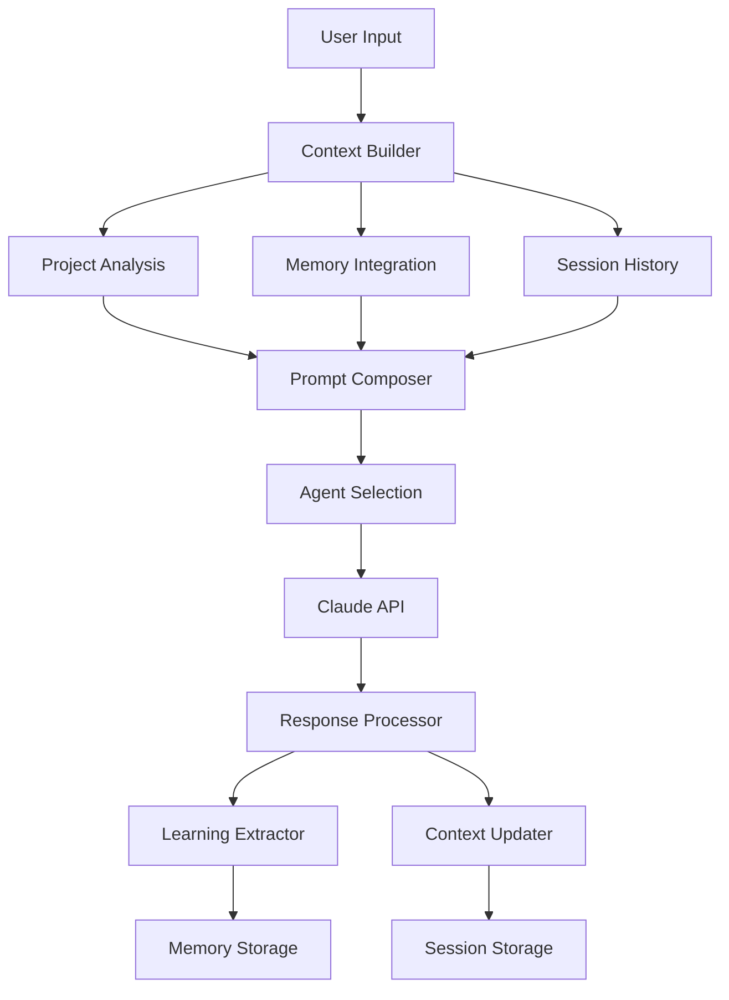

# Claude API Integration

Intelligent prompt orchestration system for Claude Code with multi-agent coordination, context management, and production-ready API integration.

## Features

### 🧠 Intelligent Context Management
- **Memory Integration**: Seamlessly integrates with `claude-memory.json` for conversation continuity
- **Project Context**: Automatically detects project structure, technologies, and git state
- **Session Management**: Maintains conversation history across interactions
- **Learning Extraction**: Automatically captures and stores key insights from conversations

### 🤖 Multi-Agent Orchestration
- **Specialized Agents**: 9 specialized AI personas for different development tasks
- **Coordinated Workflows**: Multi-agent collaboration for complex tasks
- **Role-Based Responses**: Context-aware responses based on agent specialization
- **Workflow Templates**: Pre-defined agent combinations for common scenarios

### 🔒 Production-Ready API Client
- **Rate Limiting**: Intelligent rate limiting with exponential backoff
- **Error Handling**: Comprehensive error handling and retry logic
- **Usage Tracking**: Detailed metrics for cost optimization and monitoring
- **Secure Credentials**: Environment-based API key management
- **Cost Estimation**: Real-time token and cost tracking

### 🚀 Interactive Development Environment
- **CLI Interface**: Full-featured command-line interface
- **Streaming Responses**: Real-time response streaming for better UX
- **Command System**: Specialized commands for common development tasks
- **Context Commands**: Quick access to project status and metrics

## Quick Start

### Prerequisites

```bash
# Install Python dependencies
pip install -r requirements.txt

# Set Claude API key
export CLAUDE_API_KEY=your_claude_api_key_here
```

### Basic Usage

```python
from claude_client import ClaudeAPIClient

# Initialize client
client = ClaudeAPIClient()

# Simple conversation
response = await client.send_message_async(
    "Explain the benefits of using TypeScript",
    session_id="my_project"
)

print(response["response"])
```

### Interactive Session

```bash
# Start interactive development session
python integration_service.py

# Or with specific project
cd /path/to/your/project
python /path/to/claude-api/integration_service.py
```

## Architecture

### Core Components

```
claude-api/
├── claude_client.py           # Core API client with context management
├── integration_service.py     # Development environment integration
├── prompt_templates.yaml      # Specialized agent configurations
└── requirements.txt          # Python dependencies
```

### Agent Specializations

| Agent | Role | Expertise |
|-------|------|-----------|
| **General Assistant** | AI Development Assistant | Code analysis, debugging, project planning |
| **Code Reviewer** | Senior Code Reviewer | Quality, security, performance review |
| **Architect** | Software Architect | System design, scalability, integration |
| **Performance Specialist** | Performance Engineer | Optimization, profiling, scaling |
| **Security Specialist** | Security Engineer | Vulnerability assessment, compliance |
| **DevOps Specialist** | DevOps Engineer | CI/CD, infrastructure, monitoring |
| **Data Specialist** | Data Engineer | Data architecture, ETL, analytics |
| **Frontend Specialist** | Frontend Engineer | UI/UX, modern web development |
| **Mobile Specialist** | Mobile Developer | Native and cross-platform mobile |

### Context Management Flow



## Advanced Usage

### Multi-Agent Coordination

```python
from claude_client import ClaudeAPIClient, AgentOrchestrator

client = ClaudeAPIClient()
orchestrator = AgentOrchestrator(client)

# Coordinate multiple agents for complex task
results = await orchestrator.coordinate_task(
    "Design a scalable microservices architecture",
    session_id="architecture_review",
    required_agents=["architect", "security_specialist", "devops_specialist"],
    context={"project": {"name": "E-commerce Platform"}}
)

for agent, result in results.items():
    print(f"{agent}: {result['response']}")
```

### Code Review Workflow

```python
from integration_service import ClaudeCodeIntegration

integration = ClaudeCodeIntegration(project_root="./my-project")

# Comprehensive code review
results = await integration.orchestrator.code_review_workflow(
    file_paths=["src/auth.py", "src/api.py"],
    session_id="code_review_session",
    review_type="comprehensive"
)

# Results include feedback from multiple specialized agents
```

### Custom Prompt Templates

```python
from claude_client import PromptTemplate

# Create custom agent
custom_template = PromptTemplate(
    name="api_designer",
    role="API Design Specialist", 
    system_prompt="You are an API design expert...",
    max_tokens=3000,
    temperature=0.4,
    tools=["read_file", "write_file"]
)

client.prompt_templates["api_designer"] = custom_template
```

## Interactive Commands

### General Commands
- `help` - Show available commands
- `status` - Display session metrics and usage
- `quit` - Exit the session

### Specialized Commands
- `/review <files>` - Code review with multiple agents
- `/architecture` - System architecture discussion
- `/debug <description>` - Debugging assistance
- `/optimize` - Performance optimization guidance
- `/security` - Security analysis and recommendations
- `/deploy` - Deployment strategy and CI/CD guidance
- `/test` - Testing strategy and implementation

### Example Session

```bash
🤖 Claude Code > /review src/main.py src/utils.py

🔍 Reviewing files: src/main.py, src/utils.py

📁 src/main.py:
🤖 Code_reviewer:
The code structure is well-organized with clear separation of concerns...

🤖 Security_specialist:
I've identified several security considerations:
1. Input validation on line 45 should be strengthened...

🤖 Performance_specialist:
The database queries could be optimized by adding indexes...
```

## Configuration

### Environment Variables

```bash
# Required
export CLAUDE_API_KEY=your_claude_api_key

# Optional
export CLAUDE_MODEL=claude-3-5-sonnet-20241022
export CLAUDE_MAX_RETRIES=3
export CLAUDE_RATE_LIMIT_DELAY=1.0
export CLAUDE_MEMORY_FILE=runtime/claude-memory.json
```

### Template Customization

Edit `prompt_templates.yaml` to customize agent behaviors:

```yaml
templates:
  custom_agent:
    name: "custom_agent"
    role: "Custom Specialist"
    system_prompt: |
      Your custom system prompt here...
    max_tokens: 3000
    temperature: 0.5
    tools: ["bash", "read_file"]
```

## Usage Metrics and Monitoring

### Built-in Metrics

```python
# Get usage statistics
metrics = client.get_usage_metrics()

print(f"Total requests: {metrics['total_requests']}")
print(f"Total cost: ${metrics['total_cost_usd']:.4f}")
print(f"Tokens per dollar: {metrics['tokens_per_dollar']:.0f}")
```

### Cost Optimization

- **Token Estimation**: Pre-request token counting for cost prediction
- **Context Pruning**: Automatic conversation history management
- **Template Optimization**: Specialized templates for efficient prompting
- **Batch Processing**: Multi-agent coordination reduces total API calls

## Integration with Claude Code

### Memory System Integration

The client automatically integrates with Claude Code's memory system (`runtime/claude-memory.json`):

```python
# Memory is automatically loaded and updated
memory = client.load_memory_context()

# Learning extraction happens automatically
client._extract_and_store_learnings(user_message, response, session_id)
```

### Docker Integration

Add to your Dockerfile:

```dockerfile
# Install Python dependencies for Claude API
COPY runtime/claude-api/requirements.txt /app/runtime/claude-api/
RUN pip install -r /app/runtime/claude-api/requirements.txt

# Copy Claude API integration
COPY runtime/claude-api/ /app/runtime/claude-api/

# Set environment variable
ENV CLAUDE_API_KEY=${CLAUDE_API_KEY}
```

### GitHub Actions Integration

```yaml
- name: Run Claude Code Analysis
  env:
    CLAUDE_API_KEY: ${{ secrets.CLAUDE_API_KEY }}
  run: |
    cd runtime/claude-api
    python integration_service.py --batch-mode \
      --task="review_changes" \
      --files="${{ steps.changes.outputs.files }}"
```

## Error Handling and Reliability

### Retry Logic
- Exponential backoff for rate limits
- Automatic retry for transient failures  
- Circuit breaker pattern for API failures

### Graceful Degradation
- Fallback responses when API is unavailable
- Local context preservation during outages
- Progressive feature degradation

### Logging and Monitoring
- Structured logging with contextual information
- Performance metrics and usage tracking
- Error categorization and alerting

## Security Considerations

### API Key Management
- Environment variable-based configuration
- No hardcoded credentials in source code
- Support for external secret management systems

### Data Privacy
- No sensitive data in logs
- Optional request/response sanitization
- Configurable data retention policies

### Rate Limiting Compliance
- Respect Claude API rate limits
- Exponential backoff implementation
- Usage quota monitoring and alerts

## Performance Optimization

### Token Efficiency
- Context-aware prompt optimization
- Template-based prompt generation
- Automatic conversation pruning

### Response Caching
- Optional response caching for repeated queries
- Context-based cache invalidation
- Configurable cache TTL

### Concurrent Processing
- Async/await throughout the codebase
- Concurrent multi-agent coordination
- Non-blocking I/O operations

## Testing

```bash
# Run unit tests
python -m pytest tests/

# Integration tests with mock API
python -m pytest tests/integration/

# Load testing
python tests/load_test.py
```

## Contributing

1. Fork the repository
2. Create a feature branch: `git checkout -b feature/claude-enhancement`
3. Follow the existing code style and patterns
4. Add tests for new functionality
5. Update documentation as needed
6. Submit a pull request with detailed description

## License

This project is licensed under the MIT License - see the main project LICENSE file for details.

## Support

For Claude API integration issues:
- GitHub Issues: [API Integration Issues](https://github.com/your-repo/issues?label=claude-api)
- Documentation: [API Integration Docs](https://docs.claude-code.dev/api-integration)
- Community: [Discord #claude-api](https://discord.gg/claude-code)